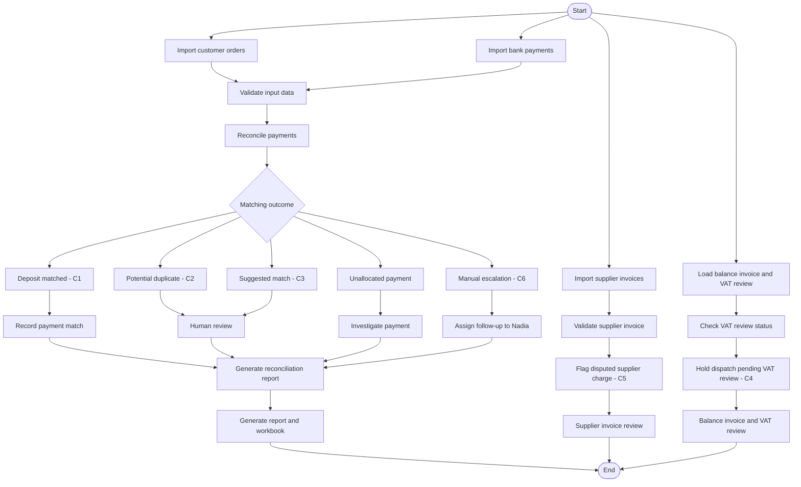

# Voss Cycles – Prototype Workflow

## Invoice and Payment Reconciliation Automation

```mermaid
flowchart TD
    A([Start]) --> B[Import customer orders]
    A --> C[Import bank payments]
    A --> D[Import supplier invoices]
    A --> E[Load balance invoice and VAT review]

    B --> F[Validate input data]
    C --> F
    D --> G[Validate supplier invoice]
    E --> H[Check VAT review status]

    F --> I[Reconcile payments]
    I --> J{Matching outcome}

    J --> K[Deposit matched - C1]
    J --> L[Potential duplicate - C2]
    J --> M[Suggested match - C3]
    J --> N[Unallocated payment]
    J --> O[Manual escalation - C6]

    K --> P[Record payment match]
    L --> Q[Human review]
    M --> Q
    N --> R[Investigate payment]
    O --> S[Assign follow-up to Nadia]

    G --> T[Flag disputed supplier charge - C5]
    H --> U[Hold dispatch pending VAT review - C4]

    P --> V[Generate reconciliation report]
    Q --> V
    R --> V
    S --> V

    V --> W[Generate report and workbook]
    T --> X[Supplier invoice review]
    U --> Y[Balance invoice and VAT review]

    W --> Z([End])
    X --> Z
    Y --> Z
```
